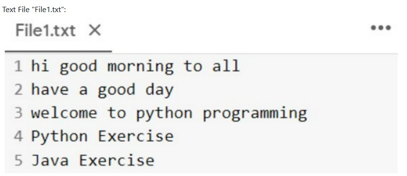
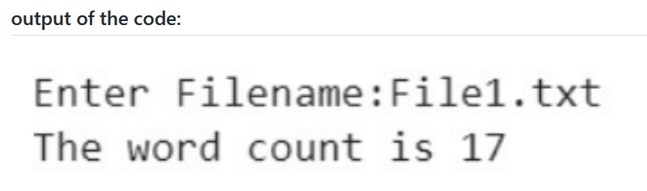

# Word-count
## AIM:
To write a python program for getting the word count from a text.
## EQUIPEMENT'S REQUIRED: 
PC
Anaconda - Python 3.7
## ALGORITHM: 
### Step 1:
creat a function that prompts user to give a name of a text file to count the number of words in it.
### Step 2: 
 use input prompt to open the file in read mode.
### Step 3: 
use split()to split the file into words.
### Step 4:  
count the  number of words using for loop.
### Step 5: 
print the word count
### Step 6: 
call the function.
## PROGRAM:
~~~
num_words =0
with open('text.txt','r') as file1:
    for i in file1:
        word =i.split()
        num_words += len(word)
print("Number of words={}".format(num_words))
~~~
### OUTPUT:

## RESULT:
Thus the program is written to find the word count from a text.
